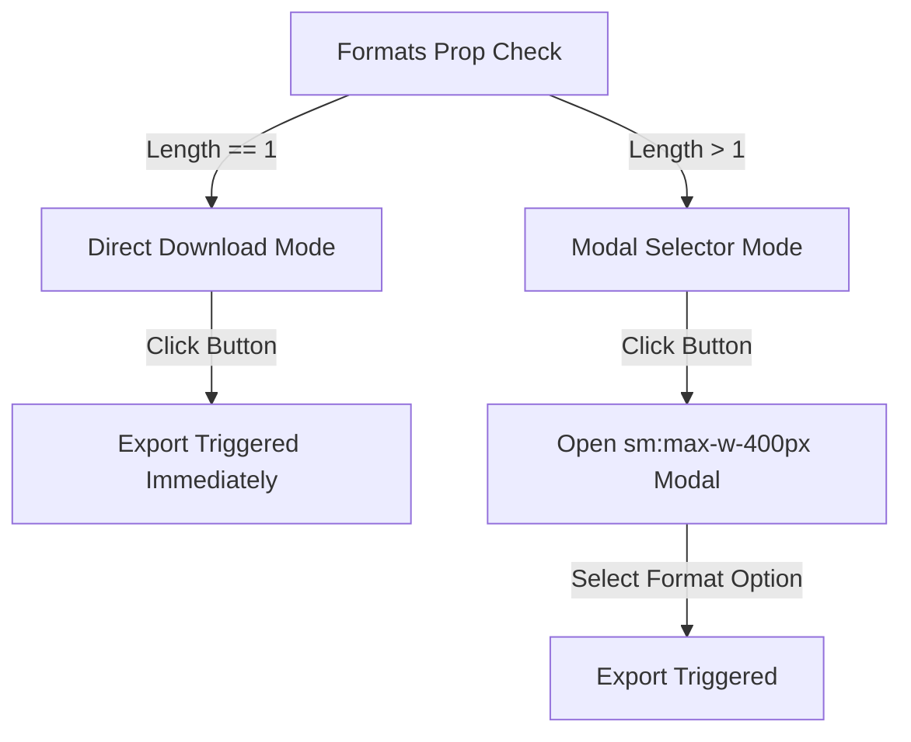
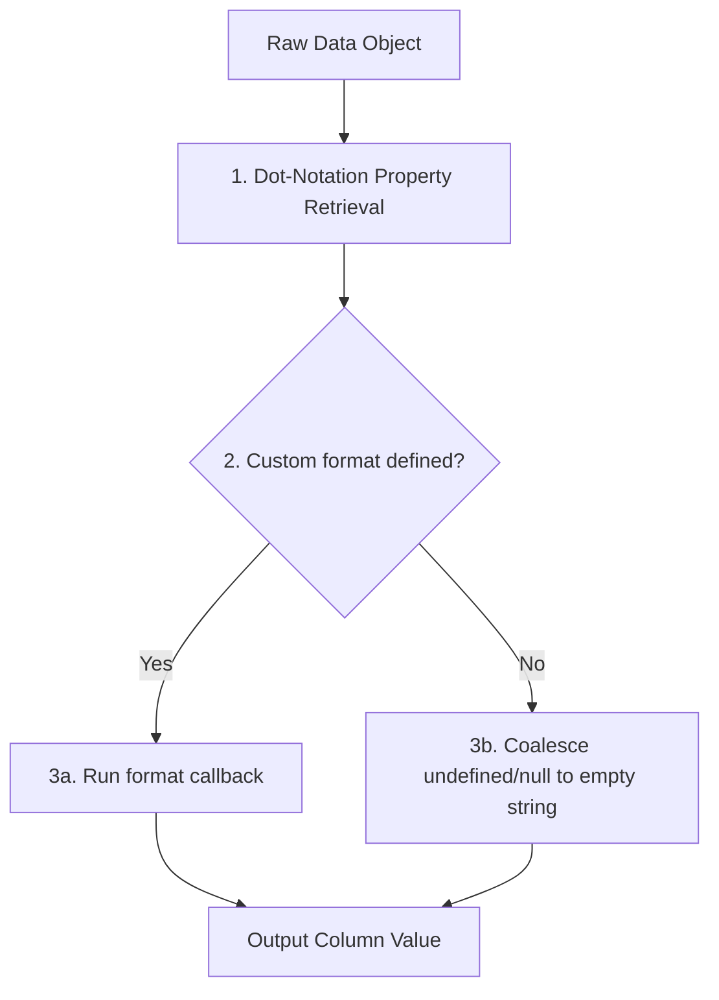

# ExportData

**Import:** `import { ExportData } from 'vlite3'`

### Description

`ExportData` is a flexible, production-ready component for exporting arrays of data to **Excel (.xlsx)**, **CSV (.csv)**, and **JSON (.json)** files. It supports two modes: **Frontend mode** (generating and downloading files directly in the browser using client-side libraries) and **Backend mode** (delegating the generation to a backend API).

Key capabilities:
- **Dot-notation support:** Easily parse nested object fields (e.g. `'address.city'`).
- **Context-aware cell formatting:** Pass both the raw property value and the parent row object to custom formatting functions.
- **Dual UI behavior:** Automatically switches between immediate export and selector modal based on configured formats.
- **Excel safety guardrails:** Enforces limits such as 31-character sheet names to prevent spreadsheet parsing crashes.
- **UTF-8 BOM for CSVs:** Correctly encodes special characters for Microsoft Excel compatibility.
- **Programmatic control:** Exposes API methods via template refs to trigger exports programmatically.

---

## Dynamic UI Modes

The component automatically adapts its interface based on the length of the `formats` prop:



1. **Direct Download Mode (Single Format)** — If `formats` contains exactly one item (e.g. `['csv']`), clicking the trigger button downloads the file immediately. No modal is displayed.
2. **Modal Selector Mode (Multiple Formats)** — If `formats` contains multiple options, clicking the trigger button opens a modal selector (`sm:max-w-[400px]`) displaying styled buttons with matching icons for each format.

---

## Props

| Prop | Type | Default | Description |
| :--- | :--- | :------ | :---------- |
| `data` | `any[]` | _(required)_ | The array of data objects to export. If empty or null in frontend mode, a warning Toast is shown. |
| `fields` | `ExportField[]` | _(required)_ | Ordered array of field definitions mapping data property paths to output columns. |
| `title` | `string` | `'Export Data'` | Used as the modal title and fallback Excel sheet name. Also serves as the base for automatic filenames. |
| `formats` | `ExportFormat[]` | `['excel', 'csv', 'json']` | Enabled export formats. If a single option is provided, direct download mode is used. |
| `filename` | `string` | — | Base filename without extension. Defaults to `{title.toLowerCase().replace(/\s+/g, '-')}-{YYYY-MM-DD}`. |
| `buttonText` | `string` | `'Export'` | Label for the trigger button. |
| `buttonIcon` | `string` | `'lucide:download'` | Iconify icon ID for the trigger button icon. |
| `mode` | `'frontend' \| 'backend'` | `'frontend'` | `'frontend'` generates files client-side. `'backend'` delegates to the `onExport` callback. |
| `onExport` | `(format: ExportFormat) => Promise<void> \| void` | — | Callback required when `mode='backend'`. Triggered with the selected format. |

---

## TypeScript Definitions

All types are exported from the component namespace:

```ts
export interface ExportField {
  field: string // Property path in the data object. Supports dot notation (e.g., 'address.city').
  title: string // Column header label in the exported file.
  format?: (value: any, row: any) => any // Optional transform function. Receives raw value and the full row object.
}

export type ExportFormat = 'excel' | 'csv' | 'json'

export interface ExportDataProps {
  data: any[]
  title?: string
  fields: ExportField[]
  formats?: ExportFormat[]
  filename?: string
  buttonText?: string
  buttonIcon?: string
  mode?: 'frontend' | 'backend'
  onExport?: (format: ExportFormat) => Promise<void> | void
}
```

---

## Deep Dive: Data Processing & Formatting Pipeline

In frontend mode, the component maps raw dataset objects into flat rows formatted for spreadsheet generation:



### 1. Dot-Notation Property Retrieval
Nested keys (e.g., `'address.city'`) are parsed using a recursive lookup helper. If any parent object along the path is undefined or null, it safely returns `undefined` without throwing errors.

### 2. Context-Aware Custom Formatters
If a field has a `format` function:
* It executes, passing **both** the raw field value and the complete row object: `format(rawValue, rowItem)`.
* This allows you to construct computed cells that rely on multiple columns (e.g., combining `firstName` and `lastName` or calculating sums).

### 3. Coalescing Nulls/Undefined
If no custom formatter is defined, the component checks the retrieved property. If the property is `undefined` or `null`, it is coalesced to an empty string (`''`) so that cells do not print text like `'null'` or `'undefined'`.

---

## File Generation Specifics (Frontend Mode)

### Excel Limit Safeguard
Microsoft Excel restricts sheet names (tabs) to a maximum of **31 characters** and forbids specific characters (like `[`, `]`, `?`, `*`, `/`, `\`). The component extracts the first 31 characters of the `title` prop to ensure compliance and prevent sheet corruption crashes:
```ts
XLSX.utils.book_append_sheet(workbook, worksheet, props.title.substring(0, 31))
```

### UTF-8 BOM for CSVs
When generating CSVs, the component prepends a UTF-8 Byte Order Mark (`\uFEFF`) to the text payload. This tells programs like Microsoft Excel that the file uses UTF-8 encoding, ensuring that special characters, accents, emoji, or non-English scripts are displayed correctly.

---

## Frontend vs. Backend Mode

### Frontend Mode
* Uses **SheetJS (xlsx)** for Excel workbook generation, **PapaParse** for CSV formatting, and standard `Blob` serializations for JSON.
* Files are constructed entirely in memory on the client side and saved using the **file-saver** library.
* Safely blocks exports if the `data` array is empty, showing a warning toast notification.

### Backend Mode
* Set `mode="backend"`. Client-side processing is skipped entirely.
* Triggering an export calls the `onExport(format)` callback.
* > [!IMPORTANT]
  > The developer's `onExport` function is fully responsible for hitting the API, handling file binary responses, and triggering the file download. If your backend callback throws an error, the component catches it and displays a warning Toast.

---

## Exposed API Methods (`defineExpose`)

You can access these properties and methods by attaching a template `ref` to the `<ExportData>` component in your Vue parent:

| Method / Property | Signature | Description |
| :--- | :--- | :--- |
| `exportData` | `(format: ExportFormat, close?: () => void) => Promise<void>` | Programmatically fires the export routine. You can optionally supply a closing callback (e.g. to dismiss a custom dropdown). |
| `availableFormats` | `ComputedRef<{ label: string; value: ExportFormat; icon: string }[]>` | The filtered list of active format objects containing values, labels, and icons. |

---

## Slots

* **No Public Slots:** This component has no public slot overrides. It renders a standard trigger button internally. For fully customized layouts, use the programmatic `exportData` method via a template `ref` on an external button component.

---

## Events

* **No Public Events:** The component does not emit public events. Lifecycle overrides should be configured through the `onExport` callback when running in backend mode.

---

## Translation Keys Reference (i18n)

The component utilizes the `$t()` utility for internationalization. All translation keys, default English fallbacks, and parameter structures are outlined below.

### ExportData Keys

| Key | Default Fallback |
| :------------------------------ | :------------------------------------------ |
| `vlite.exportData.selectFormat` | `'Select Export Format'` |
| `vlite.exportData.success` | `'Data exported successfully as {format}'` |
| `vlite.exportData.error` | `'An error occurred while exporting data.'` |
| `vlite.exportData.noData` | `'No data available to export.'` |

---

## Usage Examples

### 1. Basic Frontend Export (All Formats)

```vue
<script setup lang="ts">
import { ExportData, type ExportField } from 'vlite3'

const users = [
  {
    id: 1,
    name: 'Alice',
    email: 'alice@example.com',
    address: { city: 'New York' },
    balance: 1250.5,
  },
  { id: 2, name: 'Bob', email: 'bob@example.com', address: { city: 'London' }, balance: 340.0 },
]

const exportFields: ExportField[] = [
  { field: 'id', title: 'User ID' },
  { field: 'name', title: 'Full Name' },
  { field: 'email', title: 'Email Address' },
  { field: 'address.city', title: 'City' },
  // Custom context-aware formatter
  { field: 'balance', title: 'Balance ($)', format: (val) => `$${val.toFixed(2)}` },
]
</script>

<template>
  <ExportData
    :data="users"
    title="Users Report"
    filename="users_2025"
    :fields="exportFields"
    :formats="['excel', 'csv', 'json']" />
</template>
```

---

### 2. Single Format — Direct CSV Download

When `formats` has exactly one entry, clicking the button exports immediately with no modal popup.

```vue
<template>
  <ExportData
    :data="orders"
    title="Orders"
    button-text="Download CSV"
    button-icon="lucide:file-down"
    :fields="orderFields"
    :formats="['csv']" />
</template>
```

---

### 3. Custom Value Formatting

Use the `format` function on any field to transform values before they appear in the exported file. It receives both the cell value and the parent row object.

```vue
<script setup lang="ts">
import type { ExportField } from 'vlite3'

const fields: ExportField[] = [
  { field: 'status', title: 'Status', format: (val) => String(val).toUpperCase() },
  { field: 'price', title: 'Price', format: (val) => `$${Number(val).toFixed(2)}` },
  { field: 'date', title: 'Created At', format: (val) => new Date(val).toLocaleDateString() },
  // Calculate a computed display value based on multiple row properties
  {
    field: 'fullName',
    title: 'Full Name',
    format: (val, row) => `${row.firstName} ${row.lastName}`
  },
  {
    field: 'tags',
    title: 'Tags',
    format: (val) => (Array.isArray(val) ? val.join(', ') : val),
  },
]
</script>
```

---

### 4. Backend Export Mode

In backend mode, the component collects the user's format choice and delegates all API requests and download triggering to your callback.

```vue
<script setup lang="ts">
import { ExportData, type ExportField } from 'vlite3'
import { myApi } from '@/api'
import { saveAs } from 'file-saver'

const fields: ExportField[] = [
  { field: 'id', title: 'ID' },
  { field: 'name', title: 'Name' },
]

const handleBackendExport = async (format: 'excel' | 'csv' | 'json') => {
  const blob = await myApi.exportUsers({ format })
  saveAs(blob, `users-export.${format === 'excel' ? 'xlsx' : format}`)
}
</script>

<template>
  <ExportData
    :data="[]"
    title="Users Report"
    :fields="fields"
    :formats="['excel', 'csv']"
    mode="backend"
    :on-export="handleBackendExport" />
</template>
```

---

### 5. Programmatic Export via Template Ref

Trigger exports from custom buttons or UI panels by calling the exposed `exportData` method.

```vue
<script setup lang="ts">
import { ref } from 'vue'
import { ExportData } from 'vlite3'

const exportRef = ref<InstanceType<typeof ExportData> | null>(null)

const triggerExcel = () => {
  exportRef.value?.exportData('excel')
}
</script>

<template>
  <!-- Render component hidden from view -->
  <ExportData ref="exportRef" :data="data" :fields="fields" class="hidden" />

  <Button @click="triggerExcel" icon="lucide:file-spreadsheet">
    Export to Excel
  </Button>
</template>
```
