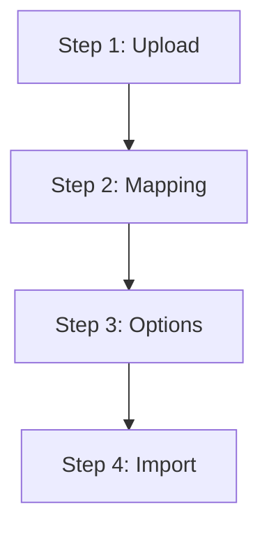
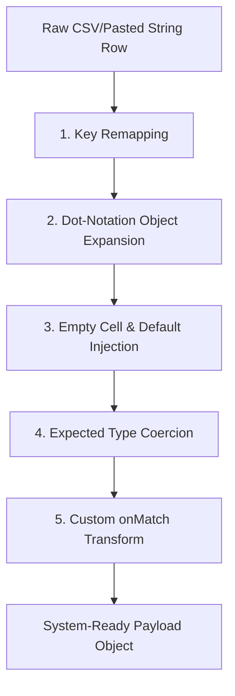

# ImportData

**Import:** `import { ImportData } from 'vlite3'`

### Description

`ImportData` is a production-ready, multi-step CSV/TSV wizard component for Vue 3. It facilitates complex, user-friendly bulk imports by guiding the user through file upload, header mapping, validation, conflict resolution settings, and real-time batch processing with robust progress indicators and failure reporting.

The component is highly optimized for performance and works seamlessly both as an inline trigger or integrated into larger UI shells like `Screen`.

---

## High-Level Wizard Flow

The import experience is split into a **4-step wizard**:



1. **Upload** — Drag & drop a `.csv` file, click to browse, or paste raw tabular data (e.g. copied from Excel/CSV/TSV). Delimiters (commas, semicolons, tabs) are auto-detected.
2. **Mapping** — Align detected CSV headers with system fields. Auto-mapping normalizes headers to `camelCase` and performs case-insensitive matching. The user can manually map fields, ignore columns, and view real-time data previews.
3. **Options** — Set conflict resolution strategies. Define how to handle rows matching existing database records (e.g., skip, update/replace, or duplicate) and how to handle entirely new records.
4. **Import** — Displays a live circular progress tracker during sequential batch processing. Once finished, shows a comprehensive performance breakdown (created, updated, skipped, failed) along with collapsible error logs for any failed rows.

---

## Props

| Prop | Type | Default | Description |
| :--- | :--- | :------ | :---------- |
| `fields` | `ImportField[]` | _(required)_ | Definitions of the system fields to map CSV columns to. See `ImportField` type below. |
| `processBatch` | `(payload: ImportBatchPayload) => Promise<ImportBatchResult>` | _(required)_ | Async callback called for each batch of rows. Receives processed, mapped data and import options. Must return a result summary object. |
| `title` | `string` | `'Import Data'` | Title displayed in the modal header and default trigger button. |
| `titleI18n` | `string` | — | i18n key for the modal title. Takes priority over `title` when set. |
| `buttonText` | `string` | `'Import'` | Label for the default trigger button. |
| `buttonIcon` | `string` | `'lucide:upload'` | Iconify icon ID for the default trigger button. |
| `batchSize` | `number` | `200` | Number of rows processed per `processBatch` call. Adjust to match API rate limits. |
| `onComplete` | `() => void` | — | Callback invoked after all batches complete. Maps to the `@complete` event. |
| `show` | `boolean` | `false` | Controls the modal's visibility externally. Enables dual-mode control (direct or parent-controlled). |

---

## TypeScript Definitions

All interfaces are exported from the component package:

```ts
export interface ImportField {
  field: string // System field key / property name in your data model.
  title: string // Human-readable label shown in the mapping table column.
  required?: boolean // If true, the field MUST be mapped or a validation error is shown.
  matchings?: string[] // Alternative CSV header names that auto-map to this field.
  expectedType?: 'string' | 'number' | 'boolean' | 'array' | 'object'
  defaultValue?: any // Value used when the CSV cell is empty/null/undefined.
  onMatch?: (value: any) => any // Transform function applied to each matched value after type coercion.
}

export interface ImportOptions {
  existing: 'add' | 'replace' | 'skip'
  // 'add'     — Create a duplicate record even if a match is found.
  // 'replace' — Overwrite (update) the matching record with imported data.
  // 'skip'    — Ignore the row if a matching record already exists.

  new: 'create' | 'skip'
  // 'create' — Create a new record for rows with no existing match.
  // 'skip'   — Ignore the row if no existing match is found.
}

export interface ImportBatchPayload {
  data: any[] // Batch of fully mapped and transformed row objects.
  options: ImportOptions // User-selected conflict resolution options from Step 3.
}

export interface ImportBatchResult {
  processed: number // Total rows processed in this batch.
  created: number // Rows that resulted in a new record being created.
  updated: number // Rows that resulted in an existing record being updated.
  skipped: number // Rows that were intentionally skipped.
  failed: number // Rows that encountered an error during processing.
  errors: {
    record: string // Row identifier (usually the 1-based row index as a string).
    message: string // Human-readable error description.
  }[]
}

export interface ImportProgress {
  total: number
  processed: number
  created: number
  updated: number
  skipped: number
  failed: number
  percentage: number
  errors: { record: string; message: string }[]
}
```

---

## Deep Dive: Data Transformation Pipeline

Before `processBatch` is called, the raw text rows are organized and converted into system-compatible payloads. Understanding this sequence is vital when configuring fields:



### 1. Key Remapping
The CSV column header is matched to the correct `field` key based on the user mapping config.

### 2. Dot-Notation Object Expansion
If the system field contains dots (e.g., `'address.city'`), the component dynamically constructs nested JavaScript objects.
* **Input row:** `{'City': 'New York'}` mapped to `address.city`
* **Intermediate structure:** `{ address: { city: 'New York' } }`

### 3. Default Value Injection
If a CSV cell is missing or resolves to an empty string (`undefined`, `null`, or `''`), and the field defines a `defaultValue`, it is injected:
* E.g., `{ role: '' }` with `defaultValue: 'User'` becomes `{ role: 'User' }`.

### 4. Expected Type Coercion
If `expectedType` is provided, values undergo primitive conversion:
* `'number'`: Converts via `Number(val) || 0`.
* `'boolean'`: Evaluated via `Boolean(val && val.toString().toLowerCase() !== 'false' && val !== '0')`.
* > [!NOTE]
  > For `'string'`, `'array'`, and `'object'` types, no automatic conversion is performed. You should handle these structures using the `onMatch` transform.

### 5. Custom `onMatch` Transform
If a field has an `onMatch` function defined, it executes last. It receives the coerced/default value and returns the final transformed value.

---

## Validation & Mapping Safeguards

When moving from **Step 2 (Mapping)** to **Step 3 (Options)**, the component runs validation. If checks fail, an alert details the errors and stops wizard progression.

### 1. Required Fields Mapping Check
Any field in the `fields` array containing `required: true` **must** be actively mapped to a CSV column. If missing, a validation error is thrown (e.g., `Required field "First Name" is not mapped.`).

### 2. Duplicate Mapping Check
A single system field cannot be mapped to multiple CSV columns simultaneously. Doing so triggers a mapping error (e.g., `Field "email" is mapped to multiple headers: Email, Primary Email.`).

### 3. Ignored Columns
Checking the **Ignore** box on a row in Step 2 excludes that column from the data pipeline completely. The column's value will not be present in the final data objects passed to the API.

---

## Conflict Resolution Options (Step 3)

The wizard lets users specify how to resolve conflicts before running the import. The choices are packaged inside the `ImportOptions` object and passed to your API inside the batch payload:

### `existing` Options (Records that already exist in your system)
* **`replace` (Update):** Overwrite existing fields with the imported data.
* **`add` (Add New):** Create a duplicate record in the system anyway.
* **`skip`:** Leave the existing record untouched.

### `new` Options (Records with no match in your system)
* **`create` (Create New):** Create a completely new record.
* **`skip`:** Ignore the row if it does not already exist.

> [!TIP]
> The exact logic for detecting whether a record is "existing" or "new" (e.g., matching by email or unique ID) must be implemented inside your `processBatch` callback, as the component has no direct database access.

---

## Performance & Optimization Design

### Avoiding Reactivity Bottlenecks
Processing massive spreadsheets with thousands of rows in Vue can cause UI lag due to Vue's deep dependency tracking. To counter this, `ImportData` declares heavy data structures (`importData`, `csvFile`, `headers`, `preview`) as **`shallowRef`** instead of `ref`. This bypasses deep proxying and ensures the UI remains extremely smooth and the memory footprint remains low.

### Sequential Chunking (`batchSize`)
Dividing a large import of 10,000 rows into standard HTTP requests prevents browser and API bottlenecks. The component slices data into chunks of `batchSize` (default `200`) and calls `processBatch` sequentially.

### Progress Simulation
To prevent the user interface from appearing frozen during slow server transactions, the circular progress indicator simulates progress using an interval. It will smoothly transition values but caps progress at `99%` until the final backend batch completes, at which point it jumps to `100%` and transitions to the complete state.

---

## Error Handling & Failure Details Log

If any row fails inside a batch, the `processBatch` callback must return an `errors` array in `ImportBatchResult`:

```json
{
  "processed": 100,
  "created": 95,
  "updated": 2,
  "skipped": 2,
  "failed": 1,
  "errors": [
    { "record": "14", "message": "Invalid phone number format." }
  ]
}
```

On completion, if `failed > 0`:
1. A warning notification appears stating the number of failures.
2. A warning badge is displayed at the bottom of the success card.
3. A collapsible list ("View Error Details") is made available. Clicking it displays a list mapping specific rows to their corresponding failure messages (e.g., `Row 14: Invalid phone number format.`).

---

## Reactivity & Modal Resets

The wizard state is fully encapsulated and auto-resets when the modal is dismissed. Closing the modal by clicking outside, using the Close/Done buttons, or pressing the `Esc` key calls the `resetState` routine.
* Reset parameters: current step goes back to `1`, `importData` array is cleared, uploaded files are set to `null`, mappings are emptied, progress metrics are zeroed.
* This ensures that opening the importer a second time provides a completely fresh slate.

---

## Slots

| Slot | Description |
| :--- | :---------- |
| `trigger` | Replaces the default trigger button. Useful for custom styling. When using the external `show` control, this slot is not needed. |

---

## Events

| Event | Payload | Description |
| :---- | :------ | :---------- |
| `@update:show` | `boolean` | Emitted when the modal is opened or closed. Facilitates `v-model:show` synchronization with parent states. |
| `@complete` | _(none)_ | Emitted after all batches have finished processing. Equivalent to the `onComplete` prop function. |

---

## Translation Keys Reference (i18n)

The component utilizes the `$t()` utility for internationalization. All translation keys, default English fallbacks, and parameter structures are outlined below.

### Screen Keys

These translation keys apply when using `ImportData` inside the unified `Screen` component:

| Key | Default Fallback |
| :-------------------------------- | :-------------------------------------------------------- |
| `vlite.screen.deleteSelected` | `'Delete Selected'` |
| `vlite.screen.listView` | `'List View'` |
| `vlite.screen.tableView` | `'Table View'` |
| `vlite.screen.refresh` | `'Refresh'` |
| `vlite.screen.searchPlaceholder` | `'Search...'` |
| `vlite.screen.confirmDeleteTitle` | `'Confirm Deletion'` |
| `vlite.screen.confirmDeleteDesc` | `'Are you sure you want to delete the selected item(s)?'` |
| `vlite.screen.confirmDeleteBtn` | `'Delete'` |
| `vlite.screen.cancelBtn` | `'Cancel'` |
| `vlite.screen.missingView` | `'Please provide a :list or :table component.'` |
| `vlite.screen.addNew` | `'Add New'` |
| `vlite.screen.filters` | `'Filters'` |
| `vlite.screen.filter` | `'Filter'` |
| `vlite.screen.applyFilters` | `'Apply Filters'` |
| `vlite.screen.exportData` | `'Export Data'` |
| `vlite.screen.importData` | `'Import Data'` |
| `vlite.screen.moreOptions` | `'More Options'` |

### ExportData Keys

Used for exporting dataset selections:

| Key | Default Fallback |
| :------------------------------ | :------------------------------------------ |
| `vlite.exportData.selectFormat` | `'Select Export Format'` |
| `vlite.exportData.success` | `'Data exported successfully as {format}'` |
| `vlite.exportData.error` | `'An error occurred while exporting data.'` |
| `vlite.exportData.noData` | `'No data available to export.'` |

### ImportData Keys

Directly used inside `ImportData.vue` and its step views:

| Key | Default Fallback |
| :---------------------------------- | :--------------------------------------------------------- |
| `vlite.importData.stepUpload` | `'Upload'` |
| `vlite.importData.stepMapping` | `'Mapping'` |
| `vlite.importData.stepOptions` | `'Options'` |
| `vlite.importData.stepImport` | `'Import'` |
| `vlite.importData.btnBack` | `'Back'` |
| `vlite.importData.btnNext` | `'Next'` |
| `vlite.importData.btnStart` | `'Start Import'` |
| `vlite.importData.btnDone` | `'Done'` |
| `vlite.importData.uploadData` | `'Upload Data'` |
| `vlite.importData.dragDrop` | `'Drag & drop a file here or click to browse'` |
| `vlite.importData.csvOnlyHint` | `'Only CSV files are supported'` |
| `vlite.importData.pasteData` | `'Or paste CSV/Excel data'` |
| `vlite.importData.process` | `'Process Data'` |
| `vlite.importData.pastePlaceholder` | `'id, name, email\n1, John Doe, john@example.com'` |
| `vlite.importData.assignFields` | `'Assign Fields'` |
| `vlite.importData.assignDesc` | `'Match your CSV columns to the correct system fields.'` |
| `vlite.importData.csvHeader` | `'CSV Header'` |
| `vlite.importData.fieldMapping` | `'System Field'` |
| `vlite.importData.preview` | `'Data Preview'` |
| `vlite.importData.noHeaders` | `'No headers mapped. Data will not be imported properly.'` |
| `vlite.importData.options` | `'Import Options'` |
| `vlite.importData.matchFound` | `'When a match is found'` |
| `vlite.importData.matchFoundDesc` | `'Determine how to handle records that already exist.'` |
| `vlite.importData.noMatch` | `'When no match is found'` |
| `vlite.importData.noMatchDesc` | `'Determine how to handle completely new records.'` |
| `vlite.importData.optAddTitle` | `'Add New'` |
| `vlite.importData.optAddDesc` | `'Creates a duplicate record instead of overwriting.'` |
| `vlite.importData.optReplaceTitle` | `'Update'` |
| `vlite.importData.optReplaceDesc` | `'Overwrites existing fields with the imported data.'` |
| `vlite.importData.optSkipTitle` | `'Skip'` |
| `vlite.importData.optSkipDesc` | `'Leaves existing records completely untouched.'` |
| `vlite.importData.optCreateTitle` | `'Create New'` |
| `vlite.importData.optCreateDesc` | `'Creates a completely new record in the system.'` |
| `vlite.importData.optSkipNewTitle` | `'Skip'` |
| `vlite.importData.optSkipNewDesc` | `'Ignores the row if it does not already exist.'` |
| `vlite.importData.processing` | `'Processing Data...'` |
| `vlite.importData.doNotClose` | `'Please do not close this window.'` |
| `vlite.importData.complete` | `'Import Complete'` |
| `vlite.importData.successCount` | `'Successfully processed {total} records.'` |
| `vlite.importData.total` | `'Total'` |
| `vlite.importData.created` | `'Created'` |
| `vlite.importData.updated` | `'Updated'` |
| `vlite.importData.skipped` | `'Skipped'` |
| `vlite.importData.failedCount` | `'{count} records failed to import'` |
| `vlite.importData.viewErrors` | `'View Error Details'` |
| `vlite.importData.hideErrors` | `'Hide Error Details'` |
| `vlite.importData.row` | `'Row'` |
| `vlite.importData.csvOnly` | `'Please upload a CSV file'` |
| `vlite.importData.emptyCsv` | `'The CSV file is empty.'` |
| `vlite.importData.parseError` | `'Failed to parse CSV: '` |
| `vlite.importData.processError` | `'Error processing CSV data'` |
| `vlite.importData.success` | `'Data imported successfully.'` |
| `vlite.importData.partial` | `'Import completed with some errors.'` |
| `vlite.importData.error` | `'A critical error occurred during import.'` |

---

## Usage Examples

### 1. Standard Importer

```vue
<script setup lang="ts">
import { ImportData, type ImportField, type ImportBatchPayload, type ImportBatchResult } from 'vlite3'

const fields: ImportField[] = [
  {
    field: 'firstName',
    title: 'First Name',
    required: true,
    matchings: ['name', 'fname', 'first name'],
  },
  {
    field: 'lastName',
    title: 'Last Name',
    matchings: ['lname', 'surname', 'last name'],
  },
  {
    field: 'email',
    title: 'Email Address',
    required: true,
    matchings: ['mail', 'email address'],
  },
  {
    field: 'role',
    title: 'User Role',
    expectedType: 'string',
    defaultValue: 'User',
  },
  {
    field: 'address.city',
    title: 'City',
    matchings: ['city', 'location'],
  },
]

const handleBatch = async (payload: ImportBatchPayload): Promise<ImportBatchResult> => {
  // Send batch payload containing mapped data and import options to your API
  const result = await myApi.importUsers(payload.data, payload.options)
  return {
    processed: payload.data.length,
    created: result.created,
    updated: result.updated,
    skipped: result.skipped,
    failed: result.failed,
    errors: result.errors || [],
  }
}
</script>

<template>
  <ImportData
    title="Import Users"
    button-text="Import CSV"
    button-icon="lucide:upload-cloud"
    :fields="fields"
    :batch-size="100"
    :process-batch="handleBatch"
    :on-complete="fetchUsers" />
</template>
```

---

### 2. Custom Trigger Button

Use the `#trigger` slot to replace the default styled button with a custom button.

```vue
<template>
  <ImportData :fields="fields" :process-batch="handleBatch">
    <template #trigger>
      <Button variant="secondary" icon="lucide:file-up"> Bulk Import </Button>
    </template>
  </ImportData>
</template>
```

---

### 3. Externally Controlled via `v-model:show`

Use this method when you want to control the importer's visibility from outside the component (e.g., matching options in a dropdown on the screen).

```vue
<script setup lang="ts">
import { ref } from 'vue'
import { ImportData } from 'vlite3'

const showImport = ref(false)
</script>

<template>
  <Button @click="showImport = true" icon="lucide:upload">Open Importer</Button>

  <ImportData
    v-model:show="showImport"
    title="Import Products"
    :fields="productFields"
    :process-batch="handleBatch"
    @complete="refetchProducts" />
</template>
```

---

### 4. With `onMatch` Transform and `expectedType`

Perform custom sanitation and cleanups on values before processing.

```vue
<script setup lang="ts">
import type { ImportField } from 'vlite3'

const fields: ImportField[] = [
  {
    field: 'isActive',
    title: 'Active Status',
    expectedType: 'boolean',
    // Normalize CSV values like 'yes', 'true', 'active', or '1' to boolean true
    onMatch: (val) => {
      const v = String(val).toLowerCase().trim()
      return v === 'yes' || v === 'true' || v === '1' || v === 'active'
    },
  },
  {
    field: 'price',
    title: 'Price',
    expectedType: 'number',
    defaultValue: 0,
    // Strip out currency symbols and parse string to float
    onMatch: (val) => parseFloat(String(val).replace(/[^0-9.]/g, '')) || 0,
  },
]
</script>
```

---

### 5. Simulating a Backend `processBatch`

Use this mockup pattern to test behavior and formatting flows locally without database writes:

```vue
<script setup lang="ts">
import type { ImportBatchPayload, ImportBatchResult } from 'vlite3'

const simulateBatch = async ({ data, options }: ImportBatchPayload): Promise<ImportBatchResult> => {
  await new Promise((resolve) => setTimeout(resolve, 800)) // Simulate network latency

  let created = 0
  let updated = 0
  let skipped = 0
  let failed = 0
  const errors = []

  data.forEach((row, i) => {
    if (!row.email) {
      failed++
      errors.push({ record: String(i + 1), message: 'Missing required field: email' })
    } else if (options.existing === 'skip' && i % 5 === 0) {
      skipped++
    } else if (options.existing === 'replace' && i % 4 === 0) {
      updated++
    } else {
      created++
    }
  })

  return { 
    processed: data.length, 
    created, 
    updated, 
    skipped, 
    failed, 
    errors 
  }
}
</script>
```
